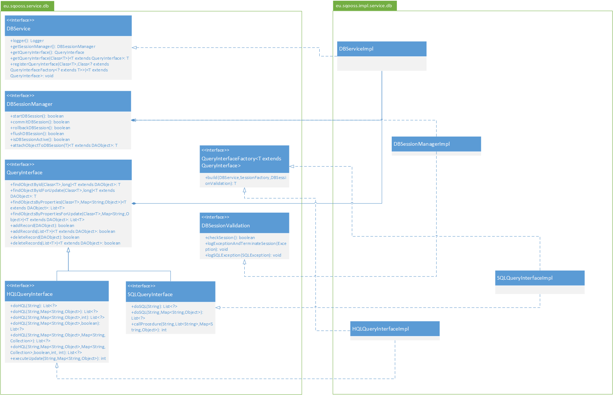

# Assignment 2 - Testing and Refactoring Report

In our Reverse Engineering and Problem Detection report Alitheia-Core was examined and several violations of class and package design principles were discovered. To reduce future maintenance cost and to improve the project's quality, it is useful to refactor the code to fix significant design principle violations. Therefore, this report shows what, why and how we removed some design principle violations by refactoring a part of the code. First, we will explain which class(es) we want to refactor and why. Then we will explain how we tested the current code to ensure the refactorings will not introduce new bugs in the system. Finally, our refactorings are explained in detail and a conclusion of our efforts is given.

## Chosen violations
In our Reverse Engineering and Problem Detection Report we explained that de `DBService` interface is an example of a violation of the Open-Closed Principle (OCP) as it strongly depends on Hibernate, especially in its `doHQL` methods. So, if the decision is made to switch to an alternative for Hibernate in the future, this interface and its implementation(s) need to be changed instead of extended. This means that many classes that depend on this interface need to be modified as well, which has a high probability of introducing new bugs which in turn increases the maintenance cost significantly.

Secondly, the `DBService` interface and therefore also its implementation, `DBServiceImpl`, also violate the Single Responsibility Principle (SRP). The `DBService` interface violates the SRP as it has more than one responsibility, namely managing database sessions, storing, retrieving and reading database objects and executing custom SQL and HQL queries. This means that when the functionality of one of these responsibilities needs to be changed, the `DBService` interface and/or its implementation need to be changed. 

Fixing the mentioned violations in this interface and its implementation will significantly reduce maintenance cost, as many classes will have to be changed less often after the refactorings, as there are many dependencies on `DBService`. The fact that `DBServiceImpl` is also a large (630 lines of code) and complex (average McCabe complexity of 5.2) class in addition to the reasons mentioned above, make the `DBService` interface and the `DBServiceImpl` class good candicates for refactoring. That is why we have decided to tackle the problems in these classes.

## Testing
Now that we have chosen to tackle the violations in the `DBServiceImpl` class, we have to make sure our refactorings are enabled by tests. To do this, we have first collected the test coverage data using the [JaCoCo](http://www.eclemma.org/jacoco/) plugin in Maven. Then we have added new tests to incrementally increase the coverage for the public methods in `DBServiceImpl`, as these methods are called by methods in other classes and need therefore be tested well. These two processes as well as the test coverage data after all tests have been written are presented in the following three sections.

### Coverage before
Running the tests with Maven resulted in an HTML coverage report containing all classes in Alitheia-Core. As our refactorings are only concerned with the `DBServiceImpl` class, the coverage data for `DBServiceImpl` is most useful. The coverage data for this class is shown in the following table for all the implemented methods of the `DBService` interface (a value of n/a indicates that the method only has one branch).

| Method                                                                  | Line coverage (%) | Branch coverage (%) |
| ----------------------------------------------------------------------- | ----------------- | ------------------- |
| getInstance                                                             | 0                 | 0                   |
| findObjectById                                                          | 0                 | n/a                 |
| findObjectByIdForUpdate                                                 | 0                 | n/a                 | 
| findObjectsByProperties                                                 | 0                 | n/a                 |
| findObjectsByPropertiesForUpdate                                        | 0                 | n/a                 |
| doSQL(String)                                                           | 0                 | n/a                 |
| doSQL(String,Map<String,Object>)                                        | 0                 | 0                   |
| callProcedure                                                           | 0                 | 0                   |
| doHQL(String)                                                           | 0                 | n/a                 |
| doHQL(String,Map<String,Object>)                                        | 0                 | n/a                 |
| doHQL(String,Map<String,Object>,int)                                    | 0                 | n/a                 |
| doHQL(String,Map<String,Object>,boolean)                                | 0                 | n/a                 |
| doHQL(String,Map<String,Object>,Map<String,Collection>)                 | 0                 | n/a                 |
| doHQL(String,Map<String,Object>,Map<String,Collection>,boolean,int,int) | 0                 | 0                   |
| addRecord                                                               | 0                 | n/a                 |
| deleteRecord                                                            | 0                 | n/a                 |
| addRecords                                                              | 0                 | 0                   |
| deleteRecords                                                           | 0                 | 0                   |
| logger                                                                  | 0                 | n/a                 |
| startDBSession                                                          | 0                 | 0                   |
| commitDBSession                                                         | 0                 | 0                   |
| rollbackDBSession                                                       | 0                 | 0                   |
| flushDBSession                                                          | 0                 | 0                   |
| isDBSessionActive                                                       | 0                 | 0                   |
| attachObjectToDBSession                                                 | 0                 | 0                   |
| executeUpdate                                                           | 0                 | 0                   |

As can be seen from the table, none of the implementations of the methods from the `DBService` interface are tested at all. Therefore we cannot just start refactoring the code, as this will likely introduce new bugs, which will only increase the future maintenance cost instead of reducing it. Therefore it was necessary to first test all these methods by writing unit tests for them. How this was done is explained in the next section.

### Writing tests
To keep the test suite organized, we have decided to create a test class for each responsibility of the `DBService` interface. Therefore we created a test class for the session management methods, one for the basic query methods and one class for the HQL methods. Besides we have also decided to create some integration tests to make sure the functionality of the classes depending on `DBService` remains the same after the refactoring. All of these test classes will be examined one by one, but first we will explain some changes required for testing the `DBServiceImpl`.

We first created a new subclass of `DAObject` called `DBObject` with only an Id and Name field to enable testing adding, getting, deleting and updating records in isolation, as this new subclass does not require much external dependencies contrary to the exising subclasses of `DAObject`. As the services of Alitheia-Core are not initialized when you run the tests, we could not simply use the database that is created when `DBService` is started to test the query methods. However, we wanted to use a real database for these tests, as we would have to mock an enormous amount of objects otherwise. Therefore we have created the class `InMemoryDatabase` that creates a simple in-memory H2 database and has some methods for session management and some getters. For this we also added a method called `prepareForTest` to `DBServiceImpl` that initializes some important fields of the class so that the others methods of the class can actually be tested.

After all required objects were set-up for testing, the test class `DBTransactionTest` was written to test the methods related to session management. This class contains tests for the following methods of the `DBService`: `startDBSession`, `commitDBSession`, `isDBSessionActive`, `rollbackDBSession`, `flushDBSession` and `attachObjectToDBSession`. For each of these methods at least three tests were created to not only test the method's behaviour in 'normal' conditions, but also to test exceptional execution, for instance when there is no active database session when you call `rollbackDBSession`. In this test class [Mockito](http://site.mockito.org/) was used a lot to mock the dependencies on Hibernate's Session and SessionFactory classes and to verify whether the correct methods of these objects were invoked by the method under test. Also [Hamcrest](http://hamcrest.org/JavaHamcrest/) is used for extensive, readable test assertions.

To test the basic query methods of the `DBService` interface, the test class `DBQueryTest` was created. This class contains tests for the following methods: `addRecord`, `deleteRecord`, `findObjectById`, `findObjectByIdForUpdate`, `findObjectsByProperties` and `findObjectsByPropertiesForUpdate`. These methods are tested extensively as they are in our opinion core functionality of the `DBService`. In addition, these tests are "stable" in that they are not likely to change if the database technology is replaced in the future, which means that they are highly valuable for future refactoring efforts. In this class the `InMemoryDatabase` is used extensively, as that is the place were the objects are actually stored and retrieved from. 

Next, the class `DBHQLQueryTest` was written to test the custom queries that can be done with the `doHQL` methods and the `executeUpdate` method. For these tests the in-memory H2 database was again used as database backend. Finally, we added several integration tests by testing extensively the interaction of several `DAObject` subclasses with `DBService`. Although we could not feasibly cover all uses of the `DBService` with tests, we cover several to ensure that not only the `DBService` is working as expected, but also that the invocation of the `DBService` is correctly refactored and to build confidence in the success of our reengineering efforts.

### Coverage after
After all tests have been written the test coverage data for the implementations of methods of the `DBService` interface  was again obtained using JaCoCo. The results are shown in the table below.

| Method                                                                  | Line coverage (%) | Branch coverage (%) |
| ----------------------------------------------------------------------- | ----------------- | ------------------- |
| getInstance                                                             | 0                 | 0                   |
| findObjectById                                                          | 100               | n/a                 |
| findObjectByIdForUpdate                                                 | 100               | n/a                 | 
| findObjectsByProperties                                                 | 100               | n/a                 |
| findObjectsByPropertiesForUpdate                                        | 100               | n/a                 |
| doSQL(String)                                                           | 0                 | n/a                 |
| doSQL(String,Map<String,Object>)                                        | 0                 | 0                   |
| callProcedure                                                           | 0                 | 0                   |
| doHQL(String)                                                           | 100               | n/a                 |
| doHQL(String,Map<String,Object>)                                        | 100               | n/a                 |
| doHQL(String,Map<String,Object>,int)                                    | 100               | n/a                 |
| doHQL(String,Map<String,Object>,boolean)                                | 100               | n/a                 |
| doHQL(String,Map<String,Object>,Map<String,Collection>)                 | 100               | n/a                 |
| doHQL(String,Map<String,Object>,Map<String,Collection>,boolean,int,int) | 81                | 94                  |
| addRecord                                                               | 100               | n/a                 |
| deleteRecord                                                            | 100               | n/a                 |
| addRecords                                                              | 52                | 67                  |
| deleteRecords                                                           | 51                | 67                  |
| logger                                                                  | 0                 | n/a                 |
| startDBSession                                                          | 98                | 83                  |
| commitDBSession                                                         | 86                | 75                  |
| rollbackDBSession                                                       | 97                | 75                  |
| flushDBSession                                                          | 97                | 75                  |
| isDBSessionActive                                                       | 98                | 88                  |
| attachObjectToDBSession                                                 | 77                | 100                 |
| executeUpdate                                                           | 60                | 83                  |

The table shows that the written tests in general increased the line and branch coverage significantly. Most methods have a line coverage of over 80 percent, which is quite high considering the fact that the other lines mostly deal with handling exceptions caused by errors in the database. For the methods that contain multiple branches, the branch coverage is in general higher than 67%. This percentage is also quite high and the missed branches are again mostly located in the exception handling code dealing with database errors.

The coverage for five of the methods has not changed as we simply have not tested them. We have decided not to test the `getInstance` and `logger` methods because these methods are simple getters. We have also decided not to write tests for the two `doSQL` methods and the `callProcedure` method, as these methods are deprecated. Moreover, we have also checked the 'Call Hierarchy' of these methods in Eclipse to see whether the methods are actually called by other classes and this is not the case. Therefore we believe it is not worth the effort to write tests for these methods.

## Refactoring
Now that the test harness is in place, the actual refactorings to the `DBService` interface and its implementation in `DBServiceImpl` could safely be done. For this we have first created a new design, then we have updated the tests according to this new design and then the refactorings were implemented. These processes will be examined in the following three sections.

### Suggested design
To resolve the SRP violation in the `DBService` class we have to make sure this interface has only one responsibility which is to manage the startup and shutdown process of the database service. This means that the other responsibilities this class currently has, managing database sessions and exposing methods to query the database, need to be extracted to their own class. Therefore we have decided to extract all methods related to session management to a new interface `DBSessionManager` which is to be implemented in `DBSessionManagerImpl`. 

Next, the methods related to querying the database needed to be extracted. However, we did not extract all these methods to a single interface, as the OCP violation would then remain. Therefore we have decided to create an interface for all basic [CRUD](http://en.wikipedia.org/wiki/Create,_read,_update_and_delete) methods that can be extended to offer extended functionality. This resulted in the `QueryInterface` interface that is extended twice to offer the extended functionality specific to HQL (in `HQLQueryInterface`) and SQL (in `SQLQueryInterface`). In this way the OCP violation is also solved, as there is no longer a hard dependency on Hibernate in the `DBService` and `QueryInterface` interfaces. 

Finally, to provide a better, more encapsulated way of instantiating the query interfaces, we have also added an interface called `QueryInterfaceFactory`. The entire new design we created, including the methods contained in each interface and the relations between the classes and interfaces, is summarized in the UML class diagram shown below.

### Updating the tests
Due to the initial structuring of test cases, very little needed to be changed to succesfully test the reengineered interfaces. The `DBTransactionTest` class still contains transaction and session related tests, which coincides with the new `DBSessionManager` interface. In addition, the tests for query methods were already separated into multiple test files.

To facilitate future extension and testing of the `QueryInterface`, we redesigned the test suite to distinguish between testing interfaces (`QueryInterface`, `HQLQueryInterface`) and testing implementations (`HQLQueryInterfaceImpl`). To do so, we created abstract `QueryInterfaceTest` and `HQLQueryInterfaceTest` classes which test the functionality of thei respective interfaces. The `HQLQueryInterfaceImplTest` class extends the previously mentioned classes by providing an instance of `HQLQueryInterfaceImpl` to test. Similarly, future reimplementations of `QueryInterface` can reuse the existing test suites without duplicating code.

Further, additional tests for `DBSessionImpl` were added to test the newly added getters for `DBSessionManager` and `QueryInterface`s. Through these tests we verify that new `QueryInterface`s and their respective factories can be registered and retrieved, and also that all existing `QueryInterface`s are available by default.

### Implementing the new design
To implement the new design we have first created the new interfaces `DBSessionManager`, `(HQL/SQL)QueryInterface` and `QueryInterfaceFactory`. Then we have added the new getters to `DBService` and implemented them in `DBServiceImpl`. Then we have implemented the new interfaces one by one until all their tests passed. We have largely done this by extracting the implementations from `DBServiceImpl` to their new location. Based on the errors in Eclipse we have then added the required fields to the implementation classes and created a constructor based on this. 

After all the classes implementing the new interface were finished, we have removed the methods from `DBService` and `DBServiceImpl` that were no longer used to clean up these classes. Then we found out that most of the implementations of the new interfaces used the same two logging functions and one function to check the status of the database session. As we did not want to have these methods implemented multiple times and therefore create duplicate code, we have created a new interface for these methods called `DBSessionValidation` that is implemented once by `DBSessionManagerImpl`.

Finally, after all tests passed, we had to fix the remaining errors in the core project. These errors were all caused by the changes to the `DBService` interface. This meant that we needed to update all method calls to the methods of the 'old' `DBService` interface to the new design. Then we have imported all other projects of Alitheia-Core into Eclipse and fixed the errors in them as well by updating some method calls. After this all tests still passed and running `mvn clean install` resulted in a successful build. This, in addition to the test coverage results explained above, convinced us that our refactorings did not break the system or introduced new bugs.

## Conclusion
What are the results of the refactoring? Are the violations gone and why? Try to include hard numbers here (complexity?,LCOM?). Why is this a good thing for future maintenance? Also explain that and why we are convinced that we haven't introduced new bugs and the system still works the same as before.

